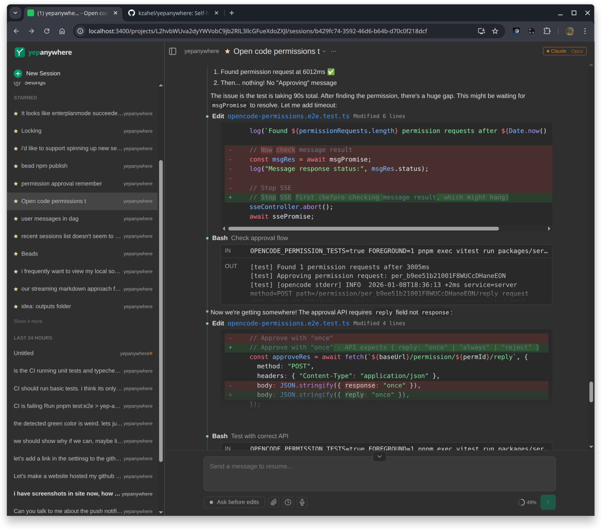

<p align="center">
  <picture>
    <source media="(prefers-color-scheme: dark)" srcset="site/branding/lockup-dark.svg">
    <source media="(prefers-color-scheme: light)" srcset="site/branding/lockup-light.svg">
    
  </picture>
</p>

<p align="center">
  <em>Mobile-first. End-to-end encrypted. Open source.</em>
</p>

<p align="center">
  <a href="https://yepanywhere.com">yepanywhere.com</a>
</p>

Mobile-first, end-to-end encrypted interface for Claude Code and Codex. Open source, self-hosted, no cloud accounts. Supervise your agents from your phone while they run on your dev machine.

## Features

- **File uploads** — Share screenshots, photos, PDFs, and code files directly from your phone's camera roll
- **Push notifications** — Get alerted when approval is needed, respond from your lock screen
- **E2E encrypted remote access** — Connect from anywhere via our free relay. We can't see your data (SRP-6a + TweetNaCl)
- **Fork/clone conversations** — Branch from any message point to explore alternatives
- **Tiered inbox** — Needs Attention → Active → Recent → Unread. Stop cycling through terminal tabs
- **Global activity stream** — See what all your agents are doing across sessions
- **Context usage tracking** — Know when a session is running out of context
- **Bulk operations** — Multi-select to archive, star, or delete sessions
- **Server-owned processes** — Client disconnects don't interrupt work
- **Interop** — View and resume sessions started in CLI, VS Code, or other tools. No new database — piggybacks on CLI persistence
- **Voice input** — Talk to your agents via browser speech API
- **Fast on mobile** — Syntax highlighting and markdown rendering happen server-side

No database, no cloud, no accounts. 100% open source (MIT).

## Supported Providers

| Provider | Diffs | Approvals | Streaming | Notes |
|----------|-------|-----------|-----------|-------|
| Claude Code | Full | Yes | Yes | Primary provider, full feature support |
| Codex | Full | Yes | Yes | Full support including diffs and approvals |

## Screenshots

<p align="center">
  
  
  
</p>
<p align="center">
  
  
  
</p>

**Works great on desktop too!**

<p align="center">
  
  
</p>

## Getting Started

If you can install Claude Code or Codex, you can install this. Minimal dependencies.

```
npm i -g yepanywhere
yepanywhere
```

Or, from source:
```bash
git clone https://github.com/kzahel/yepanywhere.git
cd yepanywhere
pnpm install
pnpm start
```

Open http://localhost:3400 in your browser. The app auto-detects installed CLI agents.

## Remote Access

**Easiest:** Use our free public relay — configure it in Settings, or via CLI for headless setups:

```bash
yepanywhere --setup-remote-access --username myserver --password "secretpass123"
```

Then connect from anywhere at [yepanywhere.com/remote](https://yepanywhere.com/remote).

All traffic is end-to-end encrypted and we can't see your data. No accounts required.

> **Note:** If you run `--setup-remote-access` while the server is running, restart it to pick up the new config.

**Self-hosted:** Prefer to run your own infrastructure? Use Tailscale, Caddy, or any reverse proxy with SSL termination. See the [remote access docs](docs/project/remote-access.md) for details.

## Why not just use the terminal?

You *can* use the terminal on your phone — but monospace text is painful on a small screen, there's no file upload, no push notifications, and no way to see all your sessions at once. This gives you a proper UI while keeping everything self-hosted and running your code locally.

## Comparison to Other Tools

There are a lot of projects in this space. We track them all: **[docs/competitive/all-projects.md](docs/competitive/all-projects.md)**

## Development

See [DEVELOPMENT.md](DEVELOPMENT.md) for build instructions, configuration options, and more.

## TOS Compliance

Yep Anywhere uses the official [`@anthropic-ai/claude-agent-sdk`](https://www.npmjs.com/package/@anthropic-ai/claude-agent-sdk) published by Anthropic. We don't handle authentication, spoof headers, or manipulate OAuth tokens. You authenticate via your own Claude CLI — we're just a remote interface to your sessions.

Read more: [How we use the SDK](https://yepanywhere.com/tos-compliance.html) | [Feb 2026 auth clarification](https://yepanywhere.com/sdk-auth-clarification.html)

## License

MIT
